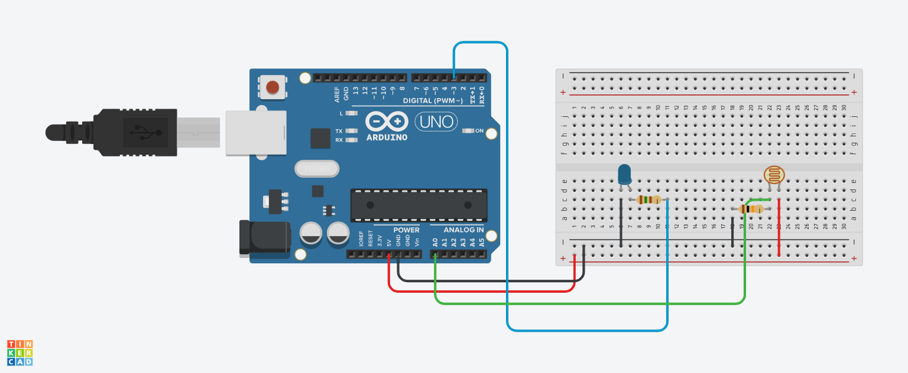

##Projeto de Poste Inteligente

Este projeto foi desenvolvido no Tinkercad, na disciplina de Internet das Coisas (IoT), para a criação de
um protótipo com Arduino que simula um poste inteligente. Este dispositivo ajusta a intensidade do LED de
acordo com a iluminação ambiente, ligando-o ou desligando-o conforme necessário.

#Componentes Usados
1 Arduino Uno
1 Placa de Ensaio
1 Sensor de Luminosidade (LDR)
1 LED
1 Resistor de 220Ω
1 Resistor de 10kΩ
14 Jumpers Macho-Macho
3 Jumpers Macho-Fêmea
Montagem do Circuito

#Explicação do Código

variaveis
int led =3;
int sensorluminosidade= A0;
 variavel para capturar a luminosidade
int luz =0; 

void setup()
{
   led é de saida
  pinMode(led,OUTPUT);
   sensor é de entrada
  pinMode(sensorluminosidade,INPUT);
}

void loop()
{
  capturar o que o sensor leu no ambiente
  analogRead é usado para leitura analogica
  
  luz = analogRead(sensorluminosidade);
  /* as portas analogicas capturam dados que variam
   de 0 até 1023 */
  
  SE ESTIVER COM POUCA LUZ NO AMBIENTE
  if(luz<500){
   digitalWrite(led,HIGH); LIGAR LED
    
  passar ao led intensidade maxima
  analogWrite(led,1023); 
    
   } else if (luz >= 500 && luz < 900) {
  
  
   passar ao led intensidade média
    analogWrite(led,500); 
    
  }else{  SE TIVER LUZ
   digitalWrite(led,LOW); DESLIGAR LED
  
   passar ao led intensidade minima
   analogWrite(led,0);
  
  }
  
}
